# curs0r pack

Seven cursor styles for Windows, each in white and black. Every set includes 17 cursor roles, clear outlines, and sizes for different display scales. Nib animates only its two loading states.

**[Download curs0r pack](https://github.com/gxlka/PC-customizable-cursor/releases/latest/download/curs0r-pack.zip)**

## Find your style

Nib uses completely static everyday cursors and smooth loading loops—no sweeps or swinging. Pen adds a gentle wiggle and a slow yellow sweep. Click any preview for a closer look.

| White | Black |
| --- | --- |
| **Nib**<br>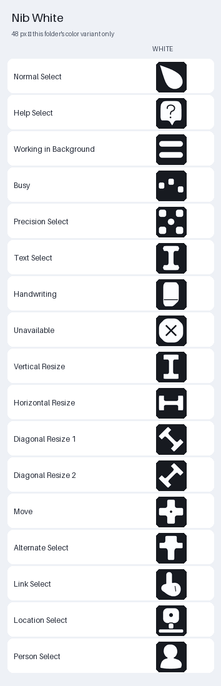 | **Nib**<br>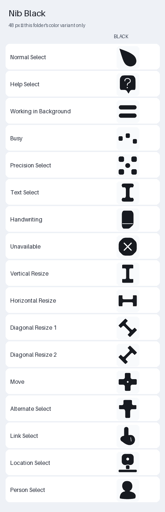 |
| **Pen**<br>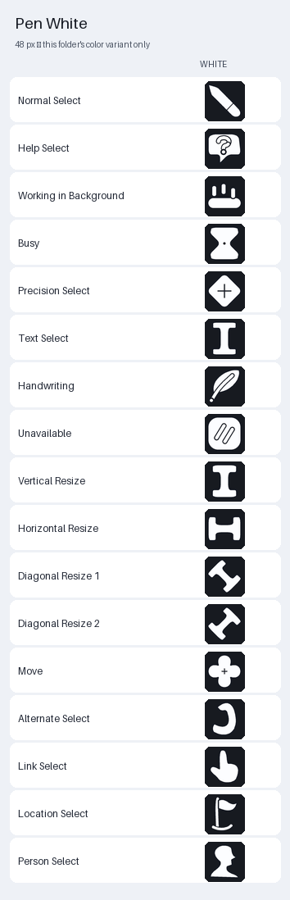 | **Pen**<br>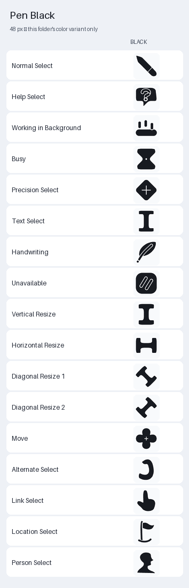 |
| **macOS**<br>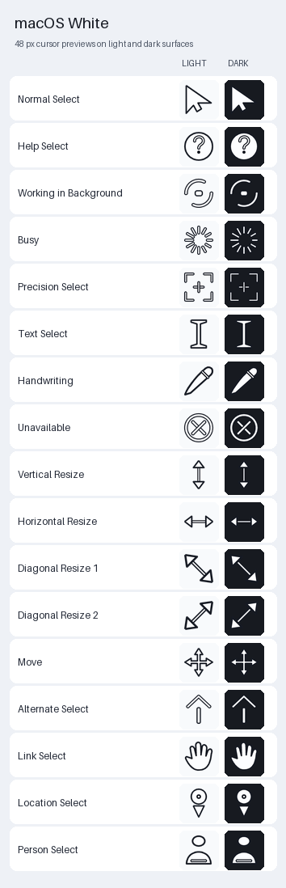 | **macOS**<br>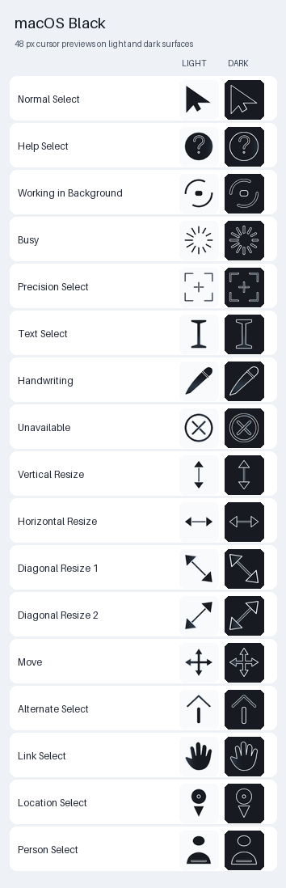 |
| **Windows Smooth**<br>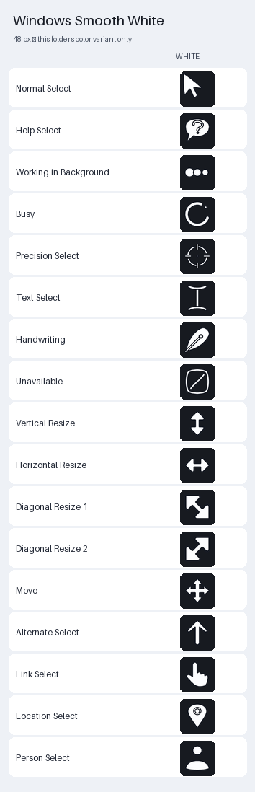 | **Windows Smooth**<br>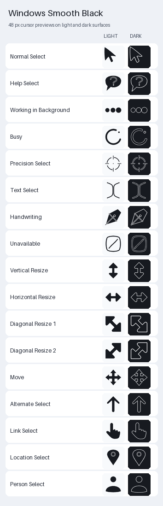 |
| **Hand**<br>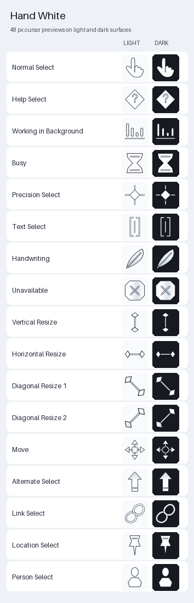 | **Hand**<br>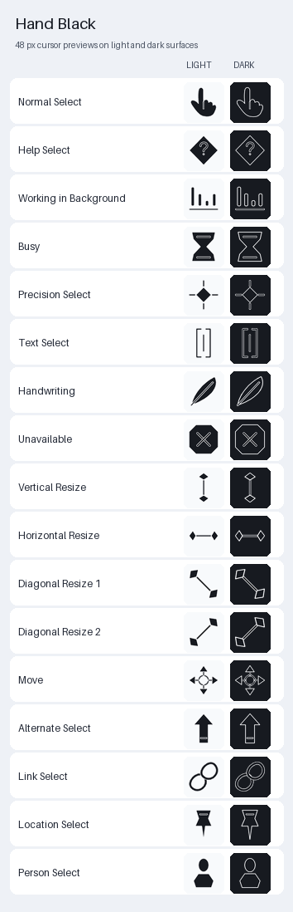 |
| **Wingline**<br>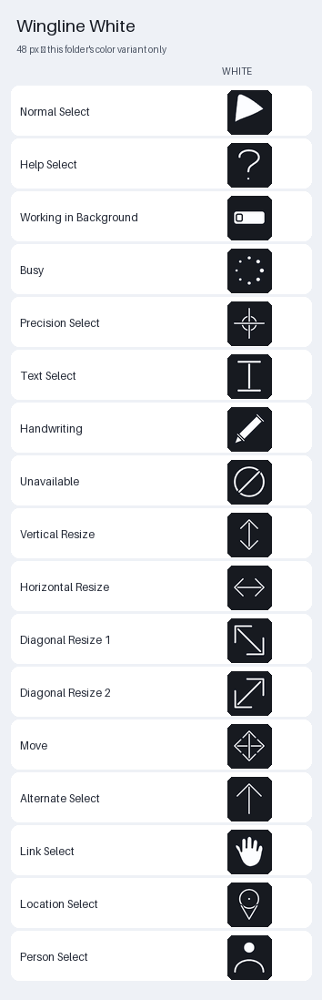 | **Wingline**<br>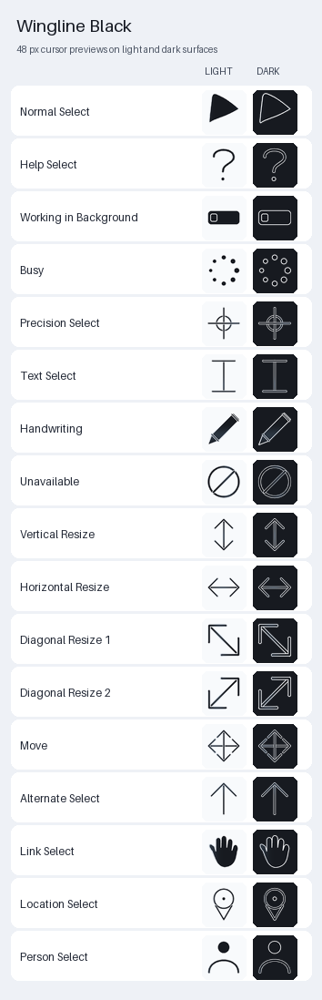 |
| **I-Beam**<br>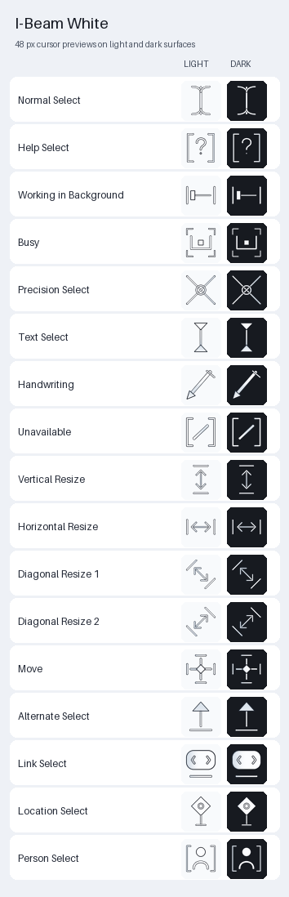 | **I-Beam**<br>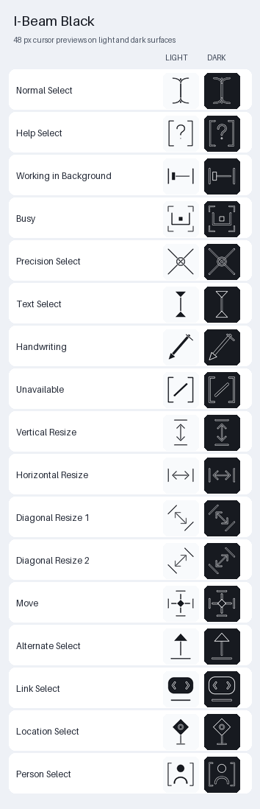 |

## Install

1. Extract the ZIP.
2. Open the folder for your preferred style and color.
3. Double-click `Install-Wingline.cmd`.

Run the installer again after updating. No administrator access or background app is needed. Static `.cur` files are included if you prefer no animation.

<details>
<summary>Build it yourself</summary>

Requires Python 3.11 or later.

```powershell
python -m pip install -r requirements.txt
python build.py
python build.py --check
```

</details>
